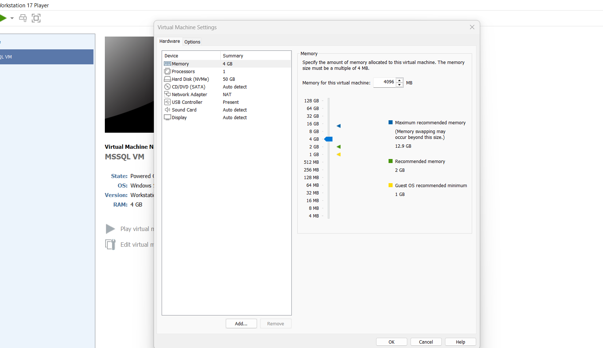
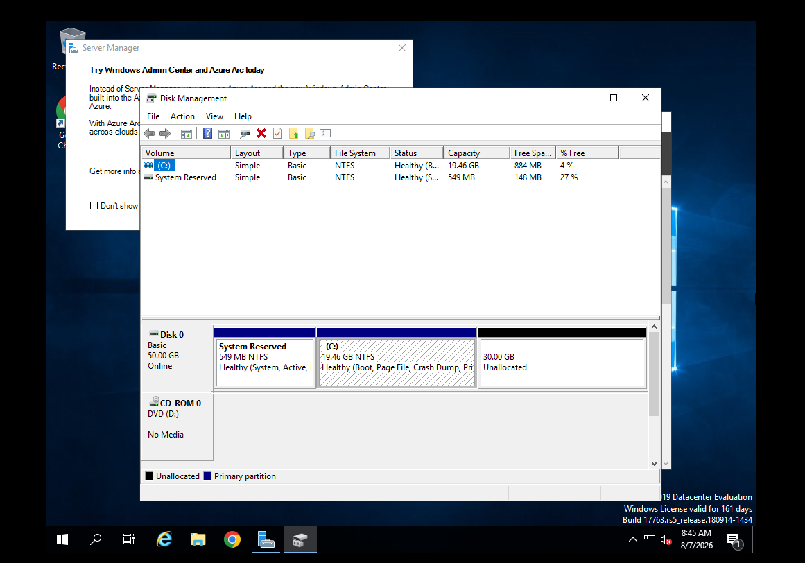
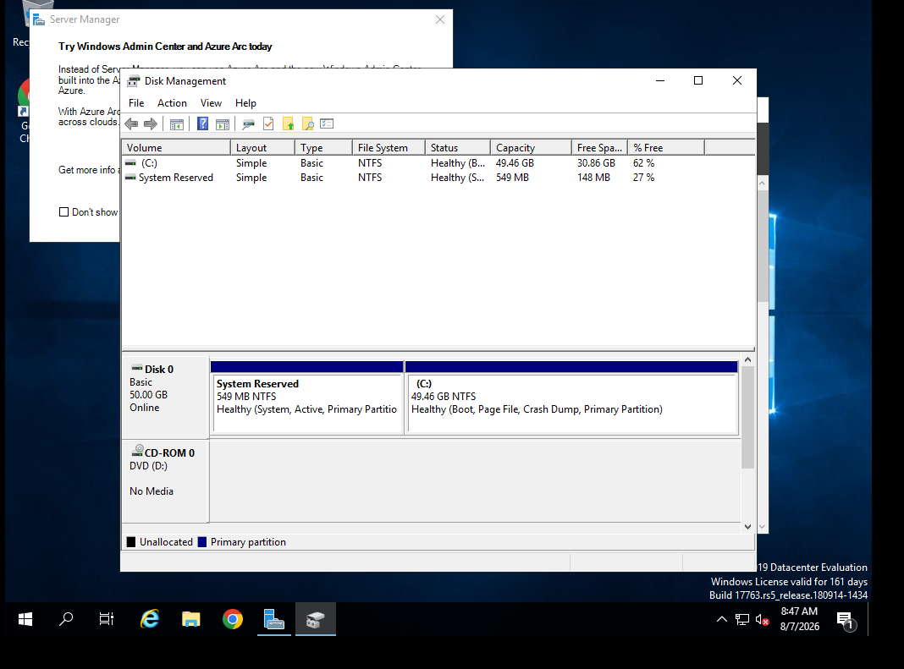
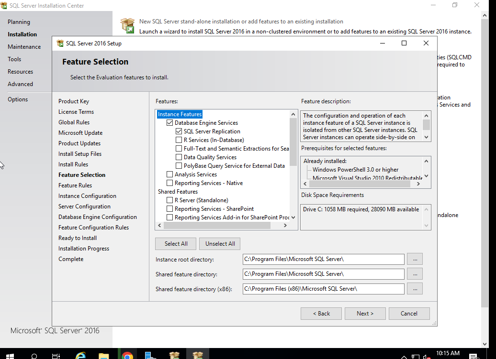
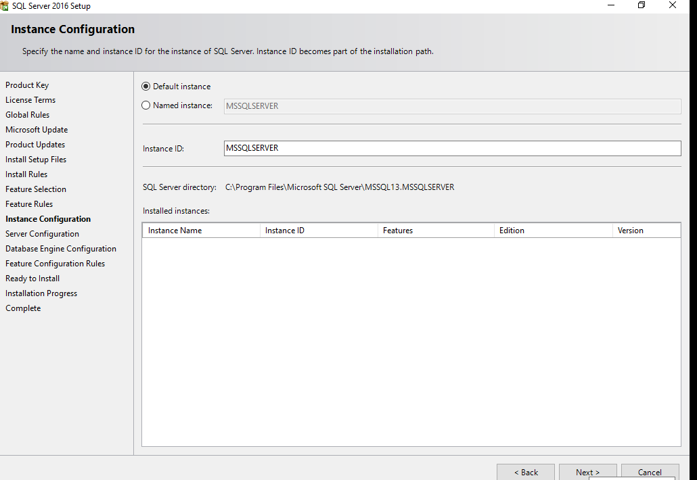
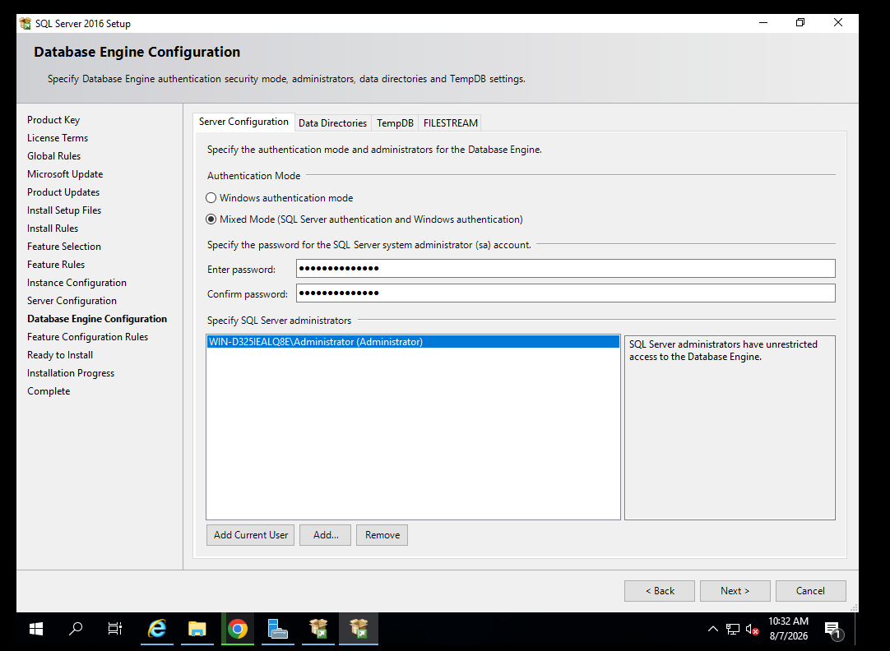
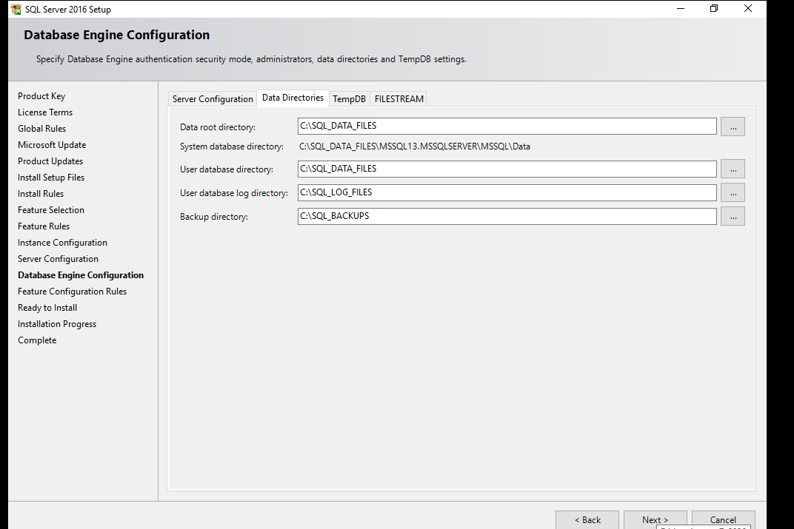
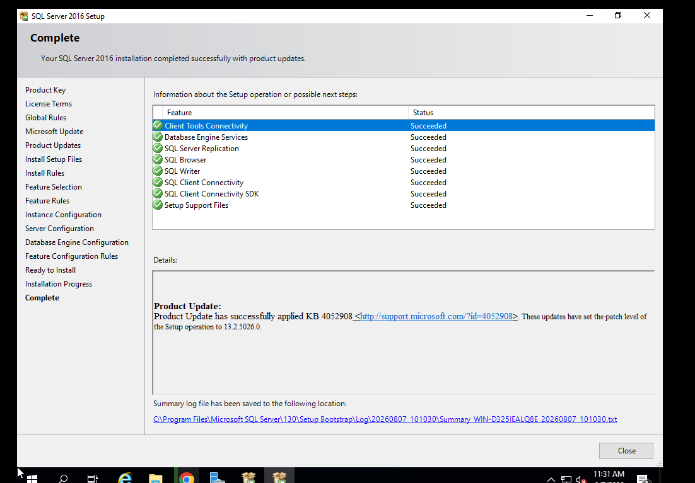
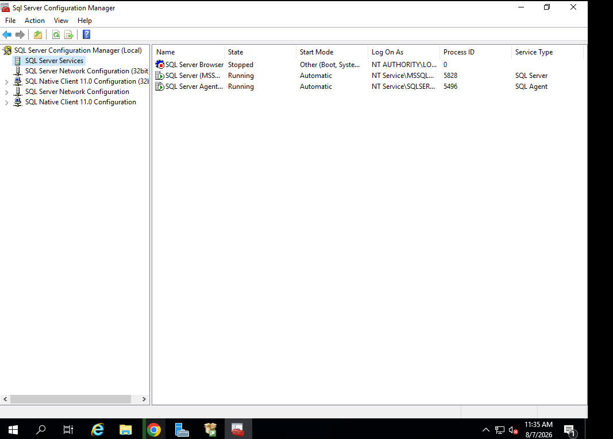
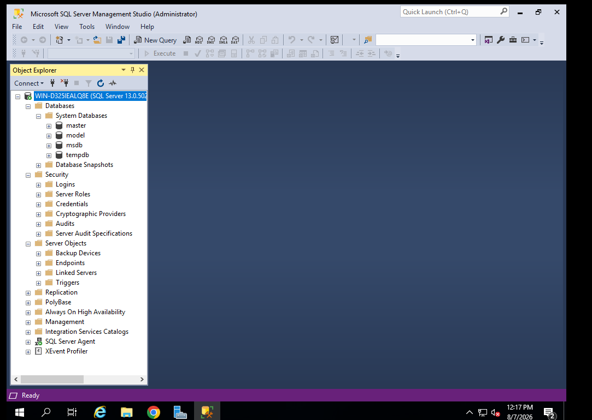

# SQL Server DBA Lab – Screenshots

This directory contains visual evidence from the Microsoft SQL Server DBA lab. The screenshots document the configuration and administration tasks completed while building the environment.

## 01. VMware Virtual Machine Configuration

Configured the Windows Server 2019 virtual machine in VMware Workstation with the memory, processor, storage, and networking resources required for the SQL Server lab.

## 02. Virtual Disk Capacity Expansion

Expanded the virtual machine disk capacity to provide sufficient storage for Windows Server, SQL Server, SQL Server Management Studio, and database files.

## 03. Windows Server Storage Management

Extended the Windows Server C: volume using Disk Management so that the operating system could use the additional virtual disk capacity.

## 04. SQL Server Feature Selection

Selected the SQL Server Database Engine and supporting components required for the database administration environment.

## 05. SQL Server Instance Configuration

Configured Microsoft SQL Server using the default `MSSQLSERVER` instance for the lab environment.

## 06. Database Engine Authentication

Configured Mixed Mode authentication to support both Windows Authentication and SQL Server Authentication, with the Windows Administrator account added as a SQL Server administrator.

## 07. SQL Server Storage Architecture

Configured dedicated directories for database data files, transaction log files, TempDB, and backups:

- `C:\SQL_DATA_FILES`
- `C:\SQL_LOG_FILES`
- `C:\SQL_TEMPDB`
- `C:\SQL_BACKUPS`

This provides practical experience with organizing SQL Server storage in preparation for understanding production database file architecture.

## 08. Successful SQL Server Deployment

Completed the Microsoft SQL Server 2016 installation successfully, with the selected SQL Server components deployed without installation failures.

## 09. SQL Server Service Management

Verified the SQL Server Database Engine and SQL Server Agent services as running through SQL Server Configuration Manager. SQL Server Browser remained stopped because the lab uses the default SQL Server instance.

## 10. SSMS Connected to SQL Server Instance

Successfully connected SQL Server Management Studio to the SQL Server instance using Windows Authentication and verified access to the core SQL Server system databases:

- `master`
- `model`
- `msdb`
- `tempdb`

## Skills Demonstrated

These screenshots provide evidence of hands-on experience with VMware virtualization, Windows Server storage administration, Microsoft SQL Server installation and configuration, authentication, SQL Server storage configuration, SQL Server services, and SQL Server Management Studio connectivity.

> All screenshots in this repository are from a personal training lab and are intended only to demonstrate practical database administration learning. Sensitive credentials and passwords are not included.
